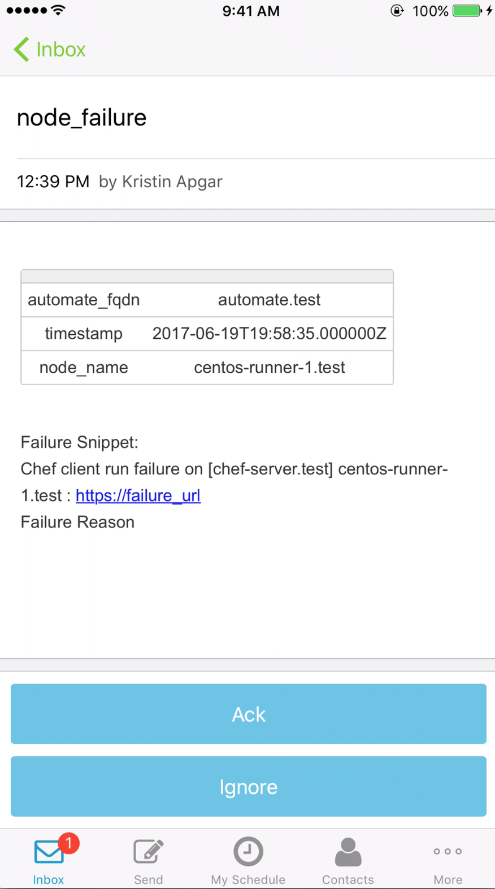

# Vistara.io
The Vistara IT Management Cloud provides all the tools, dashboards and insights you need to actually serve the business and manage a dynamic and distributed IT supply chain. It starts with the IT Operations Hub.  The Vistara IT Operations Hub is the presentation layer that centralizes discovery, monitoring, troubleshooting, maintenance, compliance and reporting, in one place.

# Pre-Requisites
* Vistara.io  
* xMatters account - If you don't have one, [get one](https://www.xmatters.com)!
* xMatters Vistara Communication Plan (see zip file in above files) imported into xMatters or created in xMatters.

# Files
* [Vistara Inbound.js](Vistara Inbound.js) - The javascript file to be pasted into a Inbound Integration Builder. It takes the payload from Vistara and formats the content to match the xMatters Form requirements and creates an xMatters Event. 
* [Vistara.zip](Vistara.zip) - The comm plan that has all the cool scripts and email format and such. 
* [Vistara Outbound Delivery.js](Vistara Outbound Delivery.js) - The javascript file to be pasted into a Inbound Integration Builder. It takes the payload from Vistara and formats the content to match the xMatters Form requirements and creates an xMatters Event.
* [Vistara Outbound Response.js](Vistara Outbound Response.js) - The javascript file to be pasted into a Inbound Integration Builder. It takes the payload from Vistara and formats the content to match the xMatters Form requirements and creates an xMatters Event.

# Installation

## Vistara
1. Edit the delivery.rb file on the Chef Automate Server.  See the following instructions to configure the Notifier Settings. [delivery.rb](http://chef-web-docs-notify.s3-website-us-west-2.amazonaws.com/config_rb_delivery.html#notifier-settings).
2. The attached delivery.rb file is an example of the configured settings pointing to a xMatters instance.  The following lines in the delivery.rb file are what send the information from Chef Automate to xMatters during an error.
      ``` 
          notifier['enable'] = true
          notifier['user_webhook_url'] = 'https://[xmatters instance]/api/integration/1/functions/[UUID]/triggers'    
      ```
The following is a sample notification message body:

      ``` 
      
      {
              "automate_fqdn":"automate.test",
              "failure_snippet":"Chef client run failure on [chef-server.test] centos-runner-1.test : https://failure_url \n Failure Reason\n",
             "exception_backtrace":"A long string with the backtrace that contains the error and \n",
             "exception_title":"Error Resolving Cookbooks for Run List:",
             "exception_message":"412 \"Precondition Failed\"",
             "automate_failure_url":"automate.test/long/url/that-takes-you-to-run-failure-page",
             "timestamp_utc":"2017-06-19T19:58:35.000000Z",
             "start_time_utc":"2017-06-19T19:58:35.000000Z",
             "end_time_utc":"2017-06-19T19:58:35.000000Z",
             "node_name":"centos-runner-1.test",
             "type":"node_failure"
        }
        
        ```
        
3. Restart the Chef Automate server after saving the delivery.rb file.


## xMatters set up
1. Import the Communication Plan (see files).  If this step is done you can skip steps 2.
2. Configure the xMatters Endpoints.  Endpoints provide a simple way to define the base URL and authentication credentials to use when making HTTP requests from a transformation script. [xMatters Endpoints](https://help.xmatters.com/OnDemand/xmodwelcome/integrationbuilder/configure-endpoints.htm)
3. Create a chef group in xMatters and add your self to the group.  Groups allow you to notify a set of users, devices, dynamic teams and other groups as a single recipient. Groups may be simple collections of members or they can employ complex shift schedules, escalation time lines, and rotations to allow you to notify only the members that are actively on duty. [xMatters Groups](https://help.xmatters.com/OnDemand/groups/groups.htm).  The name of the chef group can be changed in the Inbound IB script.
```
      var recipients = [];
      // Add a recipient targeting a user or group
      recipients.push({
            'targetName': 'chef'
      });
```
  
# Testing
1. Run a Cookbook in Chef that will force the run to fail.
2. A message should come through on your devices.  Which ever devices you have configured in xMatters.
<kbd>

</kbd>

# Troubleshooting
View xMatters Activity Stream to determine issues with Chef payload or connectivity.


